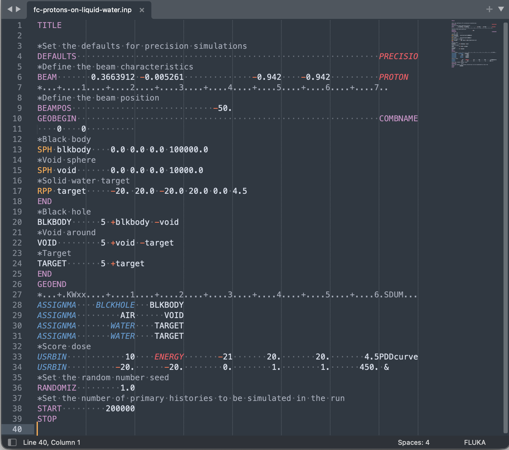

# Sublime Text FLUKA package

This package provides a FLUKA-aware editing environment in [Sublime Text](https://www.sublimetext.com/), designed for fixed-format 10-character field inputs. It combines syntax highlighting, visual column guides, and context-sensitive editing commands to reduce alignment errors and speed up input construction.

---

## Overview

FLUKA input files use strict 10-character-wide fields (`WHAT(1)...WHAT(n)`), most right-aligned. This package adds:

- Visual field structure (vertical rulers)
- FLUKA syntax highlighting
- Smart Tab / Shift+Tab behavior for card alignment
- Optional whitespace-preserving field shifting
- Snippets for alignment guides

The goal is to make manual input editing less painful and easier to do without error.

Example screenshot:




---

## Files included

### `FLUKA.sublime-syntax`

Custom syntax definition for FLUKA inputs.

- Associates with the `.inp` extension
- Highlights:
  - FLUKA cards (keywords)
  - Geometry tokens
  - Common directives
- Comments recognized when `*` is in column 1
- Includes basic overflow heuristic for long tokens

---

### `FLUKA.sublime-settings`

Editor configuration for FLUKA files:

- Vertical rulers every 10 columns
- Word wrap disabled
- Whitespace visible

This provides a visual grid matching FLUKA’s fixed-field structure.

---

### `fluka_tab.py`

Core of the package: **FLUKA-aware editing logic**.

Implements `FlukaSmartTabCommand`, which replaces normal tab behavior with context-sensitive operations.

Key capabilities:

- Detects cursor position and current line
- Identifies "cards" (non-whitespace tokens)
- Handles alignment based on 10-character field structure
- Uses regex-based token detection
- Ignores comment lines and `*` tokens

---

### `Default.sublime-keymap`

Key bindings that activate FLUKA-specific tab behavior only when the syntax is `source.fluka`.

Tab key bindings:

- `Tab` → smart right alignment / movement
- `Shift+Tab` → smart left alignment
- `Option+Tab` → right movement with whitespace preservation
- `Option+Shift+Tab` → left movement with whitespace preservation

(More details on this further below.)

---

### `fluka_comment_alignment.sublime-snippet`

Snippet for inserting a standard FLUKA column alignment guide:

```
*...+.KWxx....+....1....+....2....+....3....+....4....+....5....+....6.SDUM...
```

Usage:

- Type: `cc`
- Press: `Tab`

---

## Editing behavior

### Card definition

A "card" (in this context) is:

- Any contiguous non-whitespace token
- Excluding tokens starting with `*`

Example:

```
150.0
-1.23E-03
PROTON
```

---

### Tab behavior (`Tab`)

If cursor is followed by a card:

- Align the **end of the card** to the right edge of its current 10-character field
- If already aligned → move card to next field (insert 10 spaces before it)
- If cursor is inside a card → operate on the entire card

If no card is present:

- Default behavior: move cursor to next 10-column boundary

---

### Shift+Tab behavior (`Shift+Tab`)

- Moves the card **left**
- Removes spaces before the card
- Aligns it within the field of its **first character**
- If already aligned → attempts to move to previous field

---

### Option+Tab (`⌥+Tab`)

Right-shift with whitespace preservation:

- Inserts spaces before the card
- Removes equal number of spaces after the card
- Only works if sufficient whitespace exists after the card
- Prevents overwriting neighboring fields

---

### Option+Shift+Tab (`⌥+Shift+Tab`)

Left-shift with whitespace preservation:

- Removes spaces before the card
- Inserts equal number of spaces after the card
- Keeps everything to the right fixed in position

---

## Design constraints and safety behavior

- Commands **never overwrite non-whitespace characters**
- If a move would collide with another card:
  - Operation is aborted (no-op)
- Cards are not split across fields intentionally
- Comment lines (`*`) are ignored

---

## Installation

1. Open Sublime Text:

```
Preferences → Browse Packages...
```

2. Create directory:

```
FLUKA
```

3. Copy all files (the ones here in this repo's directory) into:

```
Packages/FLUKA/
```

4. Reload (or Quit and Relaunch):

```
Tools → Developer → Reload Plugins
```

---

## Syntax activation

### Recommended (global)

Add to user settings:

```json
"file_associations": {
    "*.inp": "FLUKA"
}
```

---

### Manual

```
View → Syntax → FLUKA
```

